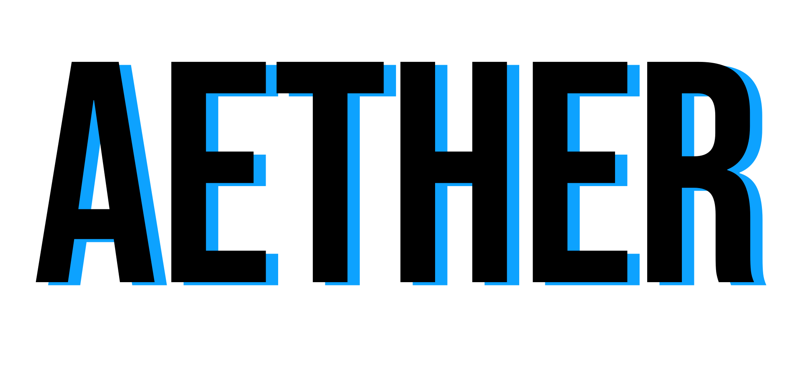

<div align="center">

<hr>
<h1 style="margin-top: 2px; margin-bottom: 2px;padding-top: 0;padding-bottom: 0;">Aether</h1>
<h4 style="margin-top: 2px; margin-bottom: 2px;padding-top: 0;padding-bottom: 0;">Vulkan & SDL3 Based</h4>
<p style="margin-top: 2px; margin-bottom: 2px;padding-top: 0;padding-bottom: 0;">大一牲的蹩脚项目</p>
</div>


## What is Aether?

大一牲的飞舞项目 <- (死要用Vulkan 死不用引擎是傻卵)
用到的库和工具链

* SDL3 with Vulkan
* ImGui for UI
* FLECS for ECS System
* C++20
* CMake28 up
* Conan2

## How to build?

### Install Conan2

```bash
# {Project Root}/ >
pip install conan
conan profile detect
conan install ./conanfile.py --profile=./conan/linux_profile # OR
# conan install ./conanfile.py --profile=./conan/windows_profile
```

### Compile with Cmake
```bash
# {Project Root}/ >
cmake -S . -B build
cmake --build build
cmake --install build
```
